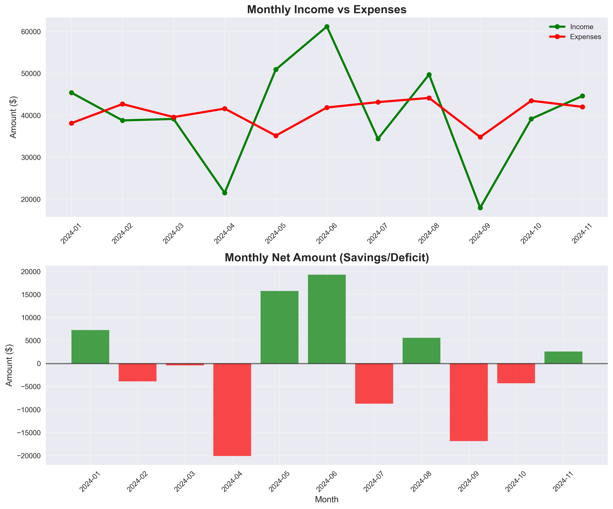
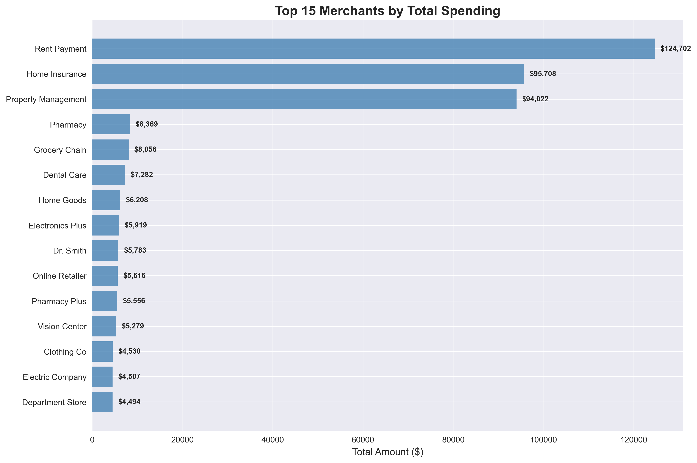

# Budget Dashboard

Python-based tool for analyzing personal financial data.

## Overview

Automated data import, cleaning, and visualization for financial analysis.

## Features

- Multi-bank CSV import
- Automated data cleaning  
- Category analysis
- Monthly spending trends

## Sample Visualizations

### Dashboard Overview


### Monthly Trends


### Category Breakdown


### Top Merchants


## Technologies

- Python
- Pandas
- Matplotlib

## Quick Start

```bash
git clone https://github.com/yourusername/budget-dashboard.git
cd budget-dashboard
pip install -r requirements.txt
python main.py
```

## Status

Functional analysis tool for personal financial data.