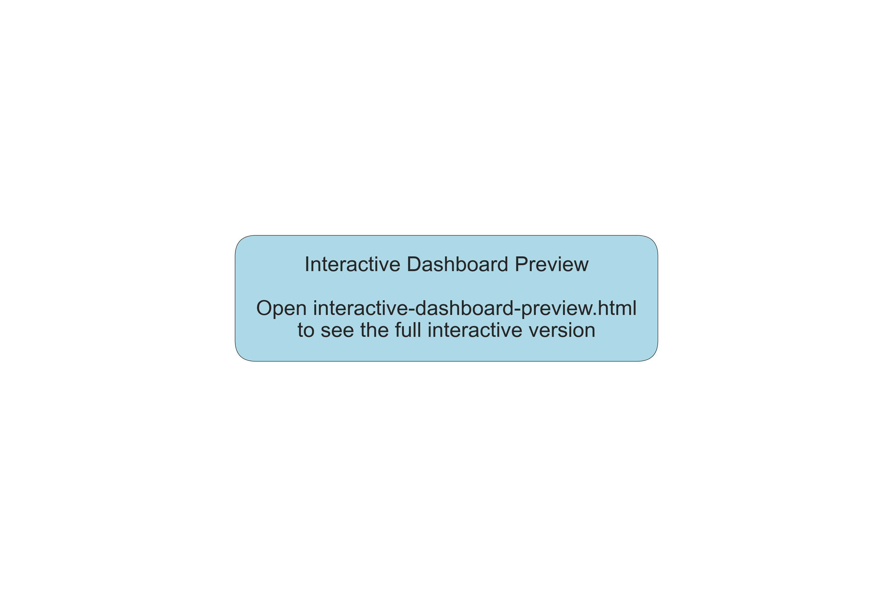
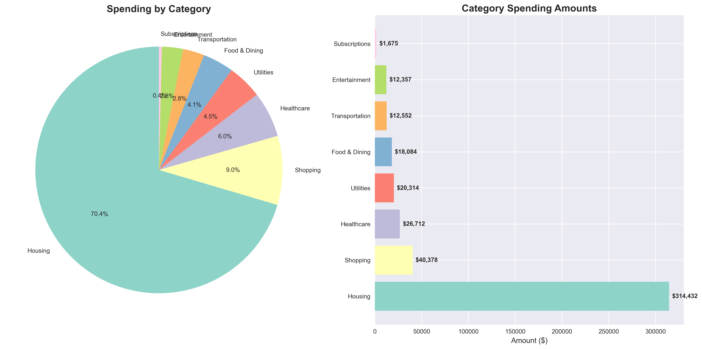

# Personal Finance Dashboard

Python-based tool for analyzing personal financial data.

## Overview

Automated data import, cleaning, and visualization for financial analysis.

## Features

- Multi-bank CSV import
- Automated data cleaning  
- Category analysis
- Monthly spending trends

## Sample Visualizations

### Dashboard Overview


### Monthly Trends


### Category Breakdown


### Top Merchants


## Technologies

- Python
- Pandas
- Matplotlib

## Implementation

This project demonstrates automated financial data analysis using Python data science libraries.

```python
import pandas as pd
import matplotlib.pyplot as plt

def analyze_spending(data):
    monthly_summary = data.groupby('month').sum()
    return monthly_summary
```

## Installation

```bash
# Clone repository (if available)
# pip install pandas matplotlib seaborn
# python main.py
```

## Status

Functional analysis tool for personal financial data.